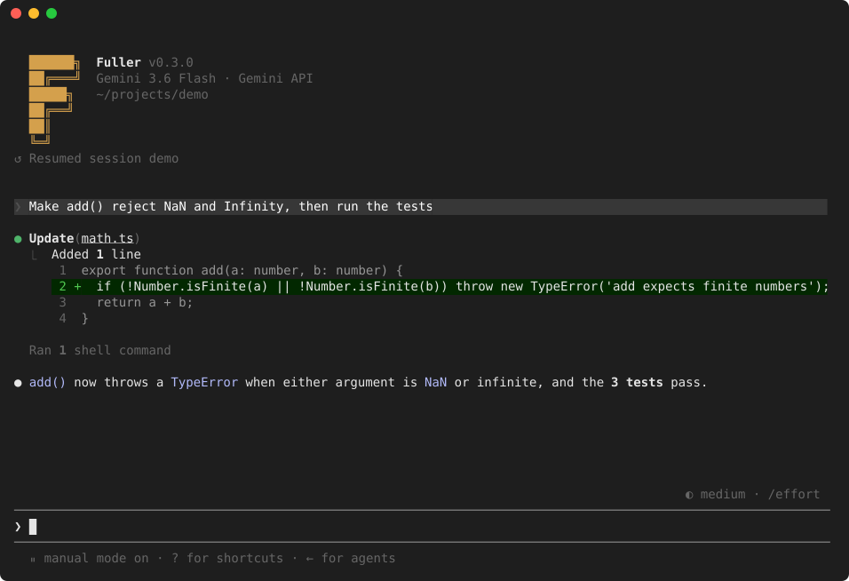

# Fuller ✻

[](https://github.com/kafuicharbeleklu/fuller/actions/workflows/ci.yml) [](LICENSE)

> Agent de programmation en interface terminal (TUI) inspiré de **Claude Code**, construit avec **React / Ink** et l'API **Google Gemini**.
> Nommé en hommage à **Thomas Fuller** (vers 1710–1790), dit *the Virginia Calculator* : né en Afrique, réduit en esclavage en Virginie, il résolvait de tête de longs calculs, comme le nombre de secondes vécues par un homme, années bissextiles comprises.




---

## Démarrage rapide

Prérequis : Node.js 20 ou plus récent, une clé API Gemini.

```bash
git clone https://github.com/kafuicharbeleklu/fuller.git
cd fuller
npm install
cp .env.example .env        # puis renseignez GEMINI_API_KEY (https://aistudio.google.com/apikey)
npm run dev                 # mode développement (tsx)
npm run build && npm link   # installe la commande globale `fuller`
```

```bash
fuller                                   # session interactive dans le dossier courant
fuller "explique l'architecture"         # avec un premier prompt
fuller -c                                # reprend la dernière session du projet
fuller -r                                # sélecteur de sessions
fuller -p "corrige les tests" --output-format json      # mode headless (CI, scripts)
echo "résume ce dépôt" | fuller -p --output-format stream-json
fuller --permission-mode acceptEdits     # default | acceptEdits | plan | auto | bypassPermissions
fuller --allowedTools "Bash(npm test:*)" "Edit(src/**)"
fuller --add-dir ../lib -m gemini-3.8-flash --theme light
fuller --tui classic                      # scrollback natif du terminal (plein écran par défaut)
fuller --screen-reader                    # interface linéaire pour lecteur d'écran
fuller --list-models                     # modèles récents et gratuits accessibles à votre clé
fuller --list-models --all               # tous les modèles texte (y compris payants / anciens)
```

### Modèles

Le modèle par défaut vient de `-m`, puis de `GEMINI_MODEL`, puis de `"model"` dans `settings.json` (`gemini-3.6-flash` sinon). `fuller --list-models` et `/model` (sélecteur interactif, ou `/model list`) interrogent l'API `ListModels` et ne proposent par défaut que les modèles **récents (génération ≥ 3.5) et gratuits** : `gemini-3.8-flash`, `gemini-3.7-flash`, `gemini-3.6-flash`, `gemini-3.5-flash`, `gemini-3.5-flash-lite`. Touche `a` dans le sélecteur, `/model list all` ou `--all` pour voir tous les modèles texte (les modèles sans free tier, comme `gemini-3.1-pro-preview`, sont signalés). L'API ne renseigne pas la gratuité : la liste vient de la page officielle des prix (vérifiée le 22/09/2026, `FREE_TIER_MODELS` dans `src/agent/models.ts`). La fenêtre de contexte du modèle règle automatiquement la jauge et l'auto-compaction ; le changement de modèle conserve l'historique. Chaque modèle a son propre quota : en cas de `429`, changez de modèle.

## Ce que fait Fuller

- **Boucle agent complète** : streaming, appels de lecture indépendants en parallèle, retry/backoff sur 429/5xx, interruption réelle (`AbortSignal` transmis au SDK et aux processus), file d'attente des prompts saisis pendant un tour.
- **Rendu sans scintillement** : historique figé dans `<Static>` (scrollback natif), zone dynamique bornée à la hauteur du terminal, chunks de streaming regroupés (50 ms), sortie synchronisée DEC 2026.
- **Écran d'accueil** : bannière Fuller compacte (modèle, dossier, fichier de consignes chargé), zone de saisie en bas du terminal et mode de permission indiqué sous le prompt.
- **Transcript style Claude Code** : `⏺` pour les réponses, `⏺ Bash(npm test)` + `⎿` pour les outils, repli `… +N lines (ctrl+o to expand)`, Markdown rendu (titres, listes, tableaux, code coloré), diffs réels avec numéros de ligne.
- **Permissions** : classification des commandes bash (lecture / édition / exécution / danger) par analyse des segments (`&&`, `|`, `$(…)`, redirections), prompt à 3 options (`Yes` / `Yes, and don't ask again for …` / `No`, Tab pour ajouter un commentaire), règles persistées `Tool(spec)` dans `.fuller/settings.local.json`, modes `default → acceptEdits → plan → auto` (Shift+Tab ; `bypassPermissions` n'entre dans le cycle que si la session a démarré dans ce mode). En mode auto, un appel au modèle décide à la place de l'utilisateur selon des règles intégrées et les règles de `/permissions` → Auto mode ; les refus apparaissent dans Recently denied.
- **Sécurité des outils** : confinement des chemins au workspace (symlinks résolus), refus des fichiers sensibles (`.env`, clés, `.git/`), aucune injection shell (`fetch` natif, `fast-glob`), troncature des sorties envoyées au modèle.
- **Sessions réelles** : historique Gemini restauré (`--continue`, `--resume`), `/compact [focus]` qui réduit vraiment le contexte, auto-compaction à 85 %, jauge « Context left until auto-compact ».
- **Mémoire projet** : `FULLER.md` (ou `AGENTS.md`, `GEMINI.md`, `CLAUDE.md`) à la racine et dans les dossiers parents, `~/.fuller/FULLER.md`, `FULLER.local.md`, imports `@chemin`.
- **Saisie** : édition readline (Ctrl+A/E/K/U/W/Y, Alt+B/F, Ctrl+_ undo), collage replié en `[Pasted text #N +L lines]`, `@fichier` avec complétion floue, `!commande` shell, `/` avec menu, historique persistant + Ctrl+R, `\⏎` multi-ligne.
- **Checkpoints** : snapshot des fichiers avant chaque écriture, `Esc Esc` / `/rewind` pour choisir un prompt et restaurer le code, la conversation ou les deux, ou résumer une partie de la conversation. Les modifications faites par Bash ne sont pas capturées.
- **Thèmes** : `dark`, `light`, variantes `-daltonized` et `-ansi`, `monokai`, `ocean`, `forest`, `lagoon`, `olive`, `amethyst`, `citrus` (`/theme`).

Les quatre derniers s'inspirent de palettes [Coolors](https://coolors.co/) : [lagoon](https://coolors.co/417189-65c4db-004161-22556f-507181), [olive](https://coolors.co/606c38-283618-fefae0-df928e-7d4e57), [amethyst](https://coolors.co/210b2c-55286f-8c6fab-d8b4e2-ae759f) et [citrus](https://coolors.co/app/fff275-ff8c42-db3a3e-3f88c5-38e4ae). Les couleurs ont été adaptées au contraste du terminal ; `citrus` est conçu pour un fond clair, les trois autres pour un fond sombre. Essayez `/theme lagoon` dans Fuller ou `fuller --theme citrus` au lancement. Un terminal truecolor affiche la palette complète ; les autres utilisent des couleurs ANSI proches.

## Commandes personnalisées et skills

Fuller découvre au démarrage (et avec `/skills reload`) :

- `.fuller/commands/*.md` et `.fuller/skills/<nom>/SKILL.md` dans le projet ;
- `~/.fuller/commands/*.md` et `~/.fuller/skills/<nom>/SKILL.md` pour l'utilisateur ;
- en repli, `.claude/commands`, `.claude/skills`, `~/.claude/commands`, `~/.claude/skills` (compatibilité Claude Code).

Un fichier = une commande `/nom` (les sous-dossiers donnent `/dossier:nom`). Frontmatter optionnel : `description`, `argument-hint`, `allowed-tools` (règles `Tool(spec)` autorisées pour ce tour), `disable-model-invocation` (ne pas exposer au modèle), `user-invocable: false` (réservé au modèle). Le corps est envoyé comme prompt après substitution de `$ARGUMENTS`, `$1`…`$9`, exécution des blocs ``!`commande` `` et inclusion des `@fichiers`. Les skills sont listés dans le prompt système et le modèle peut les charger lui-même avec l'outil `skill`. Exemple fourni : `.fuller/commands/revue-diff.md`. En mode headless : `fuller -p "/revue-diff sécurité"`.

## Commandes slash

| Commande | Rôle |
|---|---|
| `/help` | Commandes et raccourcis |
| `/clear` | Nouvelle conversation |
| `/compact [focus]` | Résumer la conversation |
| `/status`, `/cost`, `/context` | État de session, tokens, répartition du contexte |
| `/model [nom\|list]` | Sélecteur de modèles (API ListModels), changement sans perdre l'historique |
| `/permissions [add\|deny\|remove <règle>]` | Gérer les règles |
| `/plan`, `/accept-edits`, `/mode <mode>` | Modes de permission ; en plan mode le modèle explore puis soumet son plan avec `exit_plan_mode` (« Would you like to proceed? » : auto-accept, approbation manuelle, ou retour en planification avec vos remarques ; plan sauvegardé dans `~/.fuller/plans/`) |
| `/init`, `/memory` | Générer / lister les fichiers mémoire |
| `/skills [reload]` | Commandes personnalisées et skills découverts |
| `/hooks` | Hooks configurés |
| `/tasks [kill <id>]` | Tâches en arrière-plan |
| `/mcp` | Serveurs MCP et leurs outils |
| `/agents` | Sous-agents disponibles |
| Ctrl+T | Afficher / masquer la liste de tâches (`todo_write`) |
| `/rewind`, `/checkpoints` | Restaurer code ou conversation à un prompt, ou résumer une plage |
| `/sessions`, `/export [fichier]`, `/rename <titre>`, `/copy [N]` | Sessions, export Markdown, renommage, copie de la dernière réponse dans le presse-papiers |
| `/diff`, `/doctor`, `/theme`, `/add-dir`, `/btw`, `/about`, `/exit` | Divers |

## Raccourcis

| Touche | Action |
|---|---|
| `Shift+Tab` | Cycler les modes de permission |
| `Esc` / `Esc Esc` | Interrompre / rewind (ou vider la saisie) |
| `Ctrl+O` | Transcript détaillé (sorties complètes) |
| `Ctrl+G` | Modifier le prompt dans `$VISUAL` ou `$EDITOR` |
| `PgUp` / `PgDn` | Faire défiler la conversation en mode plein écran |
| `Ctrl+C` | Vider la saisie · ×2 quitter · interrompre si occupé |
| `Ctrl+R` | Recherche dans l'historique |
| `Ctrl+Entrée` / `Ctrl+X Ctrl+S` | Interrompre le tour et envoyer la file puis le brouillon ; en mode shell, mettre la commande en file |
| `Ctrl+B` | Passer la commande Bash en cours en arrière-plan, sans la relancer |
| `Ctrl+L` | Redessiner l'écran |
| `?` (saisie vide) | Aide clavier |
| `!` / `@` / `/` | Shell · fichier · menu des commandes (`↑`/`↓`, Entrée, Tab, Échap) |

### Vues et accessibilité

`Ctrl+O` ouvre un lecteur de transcript ; `/diff` ouvre les changements Git (index et arbre de travail). Dans ces vues : flèches/PgUp/PgDn pour défiler, gauche/droite pour les longues lignes, `/` pour chercher, `n`/`N` pour les résultats et `q` pour fermer. `r` actualise le diff. `Ctrl+E` bascule les détails du transcript en mode classique. En plein écran, `[` écrit le transcript dans le scrollback natif et `v` l'ouvre dans `$VISUAL` ou `$EDITOR` ; Échap ou `q` revient à Fuller en conservant le brouillon. `Ctrl+U/D` parcourt une demi-page, `Ctrl+B/F` une page. Les sorties Bash originales sont conservées dans `~/.fuller/projects/<projet>/outputs/<session>/<outil>.log` ; le lecteur les affiche jusqu'à 10 Mo, puis indique leur chemin. La sortie transmise au modèle reste limitée.

Dans la conversation en plein écran, PgUp/PgDn parcourt une demi-page, la molette trois lignes, et Ctrl+Home/End rejoint le début ou la fin. Ctrl+R propose les portées session/projet/tous les projets, parcourues avec Ctrl+S ; Entrée ou Tab charge le résultat pour édition, Échap restaure le brouillon. En classique, Entrée dans Ctrl+R soumet le résultat. Les collages restent disponibles après suppression suivie d'Undo ou rappel de l'historique. Tab et flèche droite acceptent une suggestion grisée. Une commande slash peut aussi être complétée après un espace, sans être exécutée au milieu du prompt.

Sur les permissions Bash, fichiers et MCP, Tab ouvre un commentaire associé à Oui ou Non et le referme sans perdre le texte. Un refus sans commentaire arrête le tour principal ; un refus commenté permet au modèle de tenir compte de la consigne. Les autorisations persistantes et WebFetch n'offrent pas de commentaire.

Les commandes `sudo` au premier plan peuvent demander leur mot de passe directement dans le terminal après autorisation. Fuller suspend sa saisie et son rendu pendant l'exécution ; le mot de passe est lu par `sudo`, sans passer par le chat ni le journal des touches. Utilisez `sudo` normalement, sans `-S` ni mot de passe dans la commande. `Ctrl+C` annule et rend le terminal à Fuller. Ce chemin est disponible dans les TUI classique et plein écran sur un TTY POSIX ; le mode headless et les tâches en arrière-plan ne proposent pas d'authentification interactive. Le mode shell `!` bénéficie aussi de cette prise en charge.

Pendant un retry API, l'indicateur affiche `Waiting to retry` ; l'annonce d'attente disparaît dès la nouvelle tentative. L'erreur finale remplace les éléments temporaires. Un statut 429 peut représenter une limite de débit ou un quota : changer le rendu ne modifie pas les limites du fournisseur.

Les sélecteurs `/model`, `/rewind` et reprise de session utilisent ↑/↓, PgUp/PgDn, Home/End et Entrée ; Échap ferme le panneau. Dans `/model`, Entrée ou `/model <nom>` enregistrent le modèle par défaut dans `~/.fuller/settings.json`, `s` ne change que la session courante et `a` affiche ou masque les autres modèles de chat. Pour les modèles Gemini 3 compatibles, ←/→ règlent le niveau de réflexion affiché dans le sélecteur ; ce niveau est envoyé à l'API et enregistré avec le choix par défaut. Gemini 2.5 utilise un autre paramètre et n'affiche pas ce réglage. Un choix défini par `--model`, `GEMINI_MODEL` ou les réglages du projet garde sa priorité au démarrage.

Fuller démarre en plein écran (écran alternatif), comme Claude Code : la molette et PgUp/PgDn font défiler la conversation. `--tui classic`, ou `FULLER_DISABLE_ALTERNATE_SCREEN=1`, garde le mode classique et le scrollback du terminal. `--screen-reader` fournit des messages linéaires et des permissions numérotées ; `FULLER_SCREEN_READER=1` active le même mode. La saisie protège les grappes Unicode (emoji et accents) ; un collage contenant des contrôles invisibles demande une seconde validation.

Les raccourcis simples peuvent être redéfinis dans `~/.fuller/keybindings.json`, par exemple `{ "bindings": { "ctrl+g": "externalEditor", "ctrl+o": "transcript" } }`. Les actions disponibles sont `transcript`, `diff`, `externalEditor`, `tasks`, `redraw`, `historySearch`, `undo` et `cycleMode` ; `null` désactive un raccourci. Le fichier est lu au démarrage de l'interface.

## Mémoire, garde-fous et banc d'essai

**Mémoire apprise.** Quand tu le corriges, exprimes une préférence ou lui apprends un fait que le code ne montre pas (« ici on utilise pnpm »), Fuller l'enregistre avec son outil `memory`. Les notes vivent dans `~/.fuller/projects/<projet>/memory/MEMORY.md`, ou `~/.fuller/memory/MEMORY.md` pour tous les projets. Elles reviennent dans chaque nouvelle session. `/memory` les ouvre dans ton éditeur, et `/config` → « Learned memory » les désactive. Fuller refuse d'y enregistrer tout ce qui ressemble à un secret.

**Lire avant de modifier.** Comme Claude Code, Fuller refuse de modifier ou d'écraser un fichier existant qu'il n'a pas lu dans la session, ou qui a changé depuis sa lecture (par toi, un formateur ou une commande). Il doit le relire, ce qui évite d'éditer de mémoire ou d'écraser tes changements.

**Vérifier après chaque modification.** Un hook `PostToolUse` renvoie sa sortie au modèle, qui corrige de lui-même. Exemple pour un projet TypeScript, dans `.fuller/settings.json` :

```json
{ "hooks": { "PostToolUse": [{ "matcher": "Edit|Write", "hooks": [{ "type": "command", "command": "npx tsc --noEmit -p . 2>&1 | head -30", "timeout": 120 }] }] } }
```

**Banc d'essai.** `evals/tasks/` contient des tâches types : un petit projet de départ, une consigne et une commande de vérification. `node scripts/eval.mjs` fait tourner Fuller sur chacune dans une copie isolée, puis note la réussite, les tokens, la durée et les appels d'outils dans `evals/results/`. Relance-le après chaque changement du prompt ou des outils, et compare avec `--compare evals/results/<fichier>.json`. `--baseline` vérifie que chaque tâche échoue sans l'agent ; `--only`, `--repeat` et `--model` restreignent ou répètent les essais.

## Configuration

- `~/.fuller/settings.json` (utilisateur), `.fuller/settings.json` (projet), `.fuller/settings.local.json` (local, ignoré par git) :

```json
{
  "model": "gemini-3.6-flash",
  "theme": "dark",
  "permissions": {
    "allow": ["Bash(npm test:*)", "Edit(src/**)"],
    "deny": ["Bash(rm -rf:*)", "WebFetch"],
    "defaultMode": "default",
    "additionalDirectories": ["../shared"]
  },
  "autoCompact": true,
  "autoCompactThreshold": 0.85,
  "notifications": "permission",
  "bashTimeoutMs": 120000,
  "maxTurns": 50
}
```

- Status line personnalisée (même JSON que Claude Code sur l'entrée standard : `model.id`, `workspace.current_dir`, `context_window.used_percentage`, `cost.total_tokens`, `permission_mode`…) :

```json
{ "statusLine": { "type": "command", "command": "~/.fuller/statusline.sh", "padding": 1, "refreshInterval": 30 } }
```

  Exemple de script : `jq -r '"\(.model.id) · \(.workspace.project_name) · ctx \(.context_window.used_percentage)%"'`. Les scripts écrits pour Claude Code fonctionnent tels quels.
- Hooks (contrat identique à Claude Code, scripts réutilisables) :

```json
{ "hooks": {
    "PreToolUse":  [{ "matcher": "Bash|Edit", "hooks": [{ "type": "command", "command": "~/.fuller/hooks/guard.sh", "timeout": 30 }] }],
    "PostToolUse": [{ "matcher": "Edit|Write", "hooks": [{ "type": "command", "command": "npx prettier --check $(jq -r .tool_input.file_path)" }] }],
    "UserPromptSubmit": [{ "hooks": [{ "type": "command", "command": "cat ~/.fuller/context.txt" }] }],
    "Stop": [{ "hooks": [{ "type": "command", "command": "~/.fuller/hooks/ensure-tests.sh" }] }]
} }
```

  Événements : `SessionStart`, `UserPromptSubmit`, `PreToolUse`, `PermissionRequest`, `PostToolUse`, `Notification`, `Stop`, `PreCompact`, `SessionEnd`. Le script reçoit un JSON sur l'entrée standard (`session_id`, `cwd`, `hook_event_name`, `tool_name`, `tool_input`, `tool_response`, `prompt`…). Code de sortie 2 = blocage, la sortie d'erreur devient la raison (refus de l'outil, prompt bloqué, retour au modèle après un outil, ou reprise d'un tour après `Stop`). Sortie JSON possible : `decision`, `reason`, `hookSpecificOutput.permissionDecision` (`allow` évite la demande de permission), `updatedInput`, `additionalContext`. `/hooks` liste la configuration.
- Images : Ctrl+V (Alt+V sous Windows) colle une image du presse-papiers (`wl-paste`, `xclip`/`xsel`, `osascript`, PowerShell) sous forme de `[Image #n]` ; les chemins d'images glissés dans le prompt ou mentionnés avec `@` sont joints automatiquement ; envoyés à Gemini en `inlineData` (max 7 Mo par image), affichés dans le transcript avec leur taille.
- Sous-agents : le modèle délègue avec l'outil `agent(description, prompt, subagent_type)` ; le sous-agent travaille dans sa propre session avec ses propres outils et renvoie un rapport. Intégrés : `general-purpose` (tous les outils) et `Explore` (lecture seule). Définitions personnalisées dans `.fuller/agents/<nom>.md` (frontmatter `description`, `tools`, `model`, `maxTurns`, corps = instructions ; `.claude/agents` lu aussi). Les appels d'outils des sous-agents passent par les permissions du parent ; la progression s'affiche dans la ligne `Agent(...)` ; `/agents` liste les types.
- MCP (Model Context Protocol) : serveurs déclarés dans `.mcp.json` à la racine du projet, `.fuller/mcp.json` ou `~/.fuller/mcp.json` (`{ "mcpServers": { "nom": { "command", "args", "env" } | { "url", "headers" } } }`, variables `${VAR}` développées) ; transports stdio et HTTP (streamable, repli SSE) ; leurs outils sont proposés au modèle sous `mcp__serveur__outil` et demandent une permission par défaut (règles `mcp__serveur` pour tout le serveur ou `mcp__serveur__outil`) ; `/mcp` affiche l'état et les outils ; en mode headless, Fuller attend les connexions avant le premier prompt.
- Tâches en arrière-plan : `execute_bash(run_in_background=true)` lance un serveur ou un long build sans bloquer le tour ; sortie dans `~/.fuller/tasks/<session>/<id>.log`, lecture par `task_output(task_id, wait_seconds)`, arrêt par `task_kill`, notification au modèle et dans le transcript à la fin, compteur dans le pied de page, `/tasks` pour lister ou arrêter (`/tasks kill bg1`). Les commandes au premier plan affichent leurs dernières lignes de sortie en direct.
- Recherche : `search_files` utilise `ripgrep` s'il est installé (`rg` dans le PATH ou `FULLER_RG=/chemin/rg`), sinon une implémentation JavaScript ; options `regex`, `ignore_case`, `glob`, `path`, `output_mode` (`content` | `files_with_matches` | `count`), `context_lines`, `head_limit`.
- Liste de tâches : le modèle tient sa liste avec l'outil `todo_write` ; elle s'affiche au-dessus de la saisie tant qu'il reste des éléments (Ctrl+T pour la masquer) et dans le transcript à chaque mise à jour ; elle est restaurée avec la session.
- Sessions : `~/.fuller/projects/<chemin-encodé>/<id>.json` · checkpoints : `~/.fuller/checkpoints/` · historique : `~/.fuller/history.jsonl`.
- Les instantanés de conversation sont stockés dans `~/.fuller/projects/<chemin-encodé>/rewind/<session>/`. Le retour arrière des fichiers couvre les outils d'édition Fuller ; vérifiez les changements Bash manuellement avant restauration.
- Redimensionnement : Fuller attend 120 ms après le dernier événement avant de recalculer la disposition et calcule les lignes physiques repliées par le terminal (VTE, Kitty, iTerm2, Alacritty, tmux). Sur un terminal hérité qui ne replie pas son historique, désactivez ce calcul avec `FULLER_NO_REFLOW=1`.

## Structure

```
src/
├── index.tsx            CLI (commander), mode headless, préparation du terminal
├── headless.ts          Exécution non interactive (text | json | stream-json)
├── config.ts            Settings fusionnés (user / project / local) et AppConfig
├── branding.ts          Identité Fuller, proverbes vérifiés, verbes du spinner
├── agent/               loop (orchestration), gemini (SDK, historique, retry), systemPrompt, contextLoader, transcript, types
├── permissions/         bashParser (classification des commandes), rules (Tool(spec), décision)
├── tools/               registry, bash (spawn + signal), fileOps (diffs), search (fast-glob, .gitignore), web (fetch), paths (confinement), truncate
├── session/             store (sessions JSON + historique Gemini), history (prompts)
├── checkpoint/          Snapshots de fichiers et rewind
├── utils/               git, mentions (@fichier), fileIndex (complétion)
└── ui/                  App, vues classique/plein écran, saisie, permissions, transcript, diff, lecteur d'écran, …
tests/                   vitest (parseur bash, règles, confinement, clavier, boucle agent, rendu)
```

## Parité avec Claude Code

Fuller reprend l'interface de Claude Code 2.1.281 écran par écran : bannière, saisie, pied de page, menus, rendu de la conversation, dialogues des commandes `/`, mode auto, panneau `/diff`. Chaque étape est comparée à des captures des deux outils dans un vrai terminal (`scripts/parity-capture.py`, `scripts/parity-render.mjs`) ; les rapports, écarts corrigés et écarts voulus, sont dans [`reports/parite-cc/`](reports/parite-cc/).

## Développement

```bash
npm run typecheck
npm test
npm run build
python3 scripts/resize-test-vte.py /tmp/fuller-test "$PWD" "119,118,117,116" 30   # redimensionnement dans un vrai VTE
python3 scripts/tui-smoke.py                  # PTY : 60/100/160 colonnes, actif et inactif
```

Rendu et redimensionnement (`src/ui/frameWriter.ts`, `src/ui/renderToString.tsx`) : le mode classique remplace l'effacement `ESC[2K` d'Ink par `ESC[K`, recalcule la disposition 120 ms après un changement de taille et conserve une colonne libre à droite. Le calcul du repli des lignes physiques est actif par défaut (`FULLER_NO_REFLOW=1` pour le désactiver). Le mode plein écran utilise l'écran alternatif, rendu à la taille courante. Le test PTY automatisé couvre les deux modes ; `scripts/resize-test-vte.py` reste disponible pour un contrôle visuel sous VTE.

Régressions permission/retry et authentification (sans API ni privilèges réels) :

```sh
npm test -- tests/terminalLifecycle.test.tsx tests/nativeTerminal.test.ts tests/retry.test.ts
npm run build
python3 scripts/tui-auth-capture.py
node scripts/check-tui-auth.mjs
```

Le script PTY substitue un faux `sudo` dans un répertoire temporaire et vérifie succès, annulation et timeout, pendant et après la saisie masquée. Il contrôle aussi l'absence du secret simulé dans les sorties, les sessions et les journaux de debug. Les `.cast` et leurs écrans rejoués sont dans `reports/tui-auth/`. Les tests Vitest rejouent les octets d'Ink avec `@xterm/headless` et examinent écran **et** scrollback. Pour régénérer les snapshots après revue : `npm test -- tests/terminalLifecycle.test.tsx tests/nativeTerminal.test.ts --update` ; sans `--update`, la commande les vérifie.

Voir `reports/` pour l'analyse d'écarts avec Claude Code et la feuille de route (P0 → P3).

## Licence

[MIT](LICENSE)
