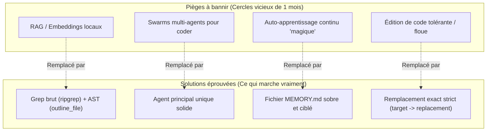
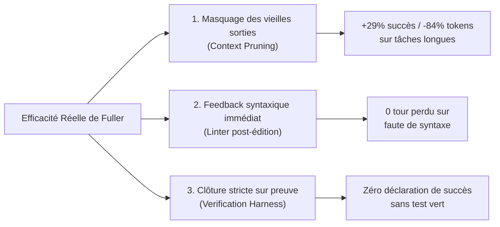

# Rapport Stratégique : Efficacité Réelle et Pragmatisme pour l'Agent Fuller
**Auteur :** Antigravity (Google DeepMind - Advanced Agentic Coding)  
**Date :** 25 Septembre 2026  
**Cible :** Agent CLI/TUI Fuller (`kafuicharbeleklu/fuller`)  
**Statut :** Directive d'orientation validée  

---

## 1. Contexte & Enseignement Fondateur du Projet

Le développement de Fuller a traversé une étape charnière qui éclaire toute la feuille de route future :
- **L'impasse initiale :** Le projet avait démarré sous **Python + Rich**. Bien que Rich soit une bibliothèque d'affichage élégante, elle est inadaptée aux applications de terminal fortement interactives, à états asynchrones et à saisie brute (raw mode). Résultat : des bugs en cascade, une dette technique inextricable et un blocage en boucle pendant plus d'un mois.
- **La bascule décisive :** La réécriture intégrale en **Node.js / TypeScript avec React + Ink** a permis de construire une architecture à arbre de composants réactif (identique à celle de Claude Code). En **3 jours**, le projet a dépassé en stabilité, fidélité TUI et fluidité ce qui n'avait pu être achevé en un mois sous Python.

### Directive formelle pour l'évolution de l'agent
**Ne pas reproduire au niveau de l'agent (raisonnement, mémoire, outils) l'erreur commise au niveau de l'interface.**  
Il est impératif de proscrire les "fausses bonnes idées" théoriques et les architectures sur-dimensionnées qui enferment les projets dans des boucles de régression. Chaque mécanisme ajouté doit être direct, prouvé, mesurable et économe en ressources.

---

## 2. Matrice d'Arbitrage : Pièges Théoriques vs Solutions Éprouvées

| Approche théorique (À BANNIR) | Pourquoi c'est un piège | Solution pragmatique retenue (CE QUI MARCHE) |
| :--- | :--- | :--- |
| **RAG / Embeddings locaux / Base vectorielle (Chroma, etc.)** | Indexation lente, consommation CPU excessive, désynchronisation immédiate au moindre `git checkout`, incapable de matcher des noms de symboles exacts. | **`search_files` (`ripgrep`) + `glob` + `outline_file` (AST natif)** : 0 ms d'indexation, instantané, exact à 100 %. |
| **Swarm d'agents multiples pour coder** (planner + coder + tester + critique pour chaque prompt) | Latence multipliée par 5, explosion de tokens, perte de contexte, incohérences de diff et contradictions entre sous-agents. | **Un seul agent principal robuste** qui conserve le fil directeur. Des sous-agents *uniquement* pour de la lecture/exploration isolée. |
| **Auto-apprentissage continu "magique"** (méta-réflexion autonome après chaque action) | L'agent hallucine sur ses propres réflexions, pollue sa fenêtre de contexte et tourne en rond sur des règles obsolètes. | **Fichier Markdown simple (`MEMORY.md`)**, alimenté sur retour explicite (`/learn`) ou piège avéré du dépôt. |
| **Édition de code floue / tolérante (Fuzzy matching)** | Risque de casser le code silencieusement, d'effacer des blocs voisins ou de modifier la mauvaise fonction. | **Remplacement exact strict** (`target_content` $\rightarrow$ `replacement_content`). En cas d'échec, retour d'erreur clair avec lignes candidates et relecture ciblée. |

---

## 3. Les 3 Leviers Majeurs d'Efficacité

Pour maximiser l'efficacité de Fuller, la priorité absolue est concentrée sur les trois chantiers qui apportent les gains les plus massifs et documentés dans l'état de l'art (Claude Code, Anthropic Context Management, SWE-agent).

---

### Levier 1 : Masquage récupérable des vieilles sorties d'outils (*Context Pruning*)
- **Fichier cible :** `src/agent/loop.ts`.
- **Diagnostic :** Lorsqu'un agent lit un fichier de 500 lignes ou exécute un test produisant 150 lignes de logs au tour 2, ces données restent intégralement présentes aux tours 3, 4, ... 15. À chaque tour, Gemini réingère ces milliers de tokens inutiles. Cela dilue l'attention du modèle, augmente la latence, explose les quotas et provoque des hallucinations.
- **Solution validée :**
  - Conserver intactes les paires appel/réponse d'outils des 2 ou 3 tours les plus récents (ce dont le modèle a besoin pour agir).
  - Pour les tours antérieurs, compacter le corps de la réponse d'outil en un résumé succinct + le chemin du fichier complet sauvegardé sur disque (ex: `[read_file: src/agent/loop.ts (380 lines read, full output saved to /tmp/fuller-...)]`).
  - Préserver impérativement les métadonnées d'outils et les signatures de réflexion (thinking) requises par l'API Gemini.
- **Impact attendu :** +29 % de taux de réussite sur les tâches complexes et jusqu'à -84 % de tokens consommés (mesures Anthropic).

---

### Levier 2 : Feedback syntaxique immédiat post-édition
- **Fichier cible :** `src/tools/fileOps.ts`.
- **Diagnostic :** Quand l'agent modifie un fichier et commet une erreur de syntaxe triviale (accolade manquante, virgule superflue), il ne s'en aperçoit qu'en lançant un build ou un test au tour suivant, voire conclut par erreur.
- **Solution validée :**
  - Dès qu'un `edit_file` ou `write_file` s'exécute avec succès, lancer en coulisse une validation syntaxique ultralégère en mémoire :
    - Fichiers `.json` : `JSON.parse`.
    - Fichiers `.js` / `.mjs` / `.cjs` : `node --check`.
    - Fichiers `.ts` / `.tsx` : analyseur AST TypeScript déjà embarqué dans Fuller (`src/tools/outline.ts`).
  - Si une erreur de syntaxe est détectée, l'inclure immédiatement dans le message retourné par l'outil :  
    `File edited successfully. Warning: SyntaxError on line 42: Unexpected token '}'`.
  - Le modèle corrige immédiatement sa faute dès le tour suivant, sans intervention utilisateur et sans perte de temps.

---

### Levier 3 : Rigueur de clôture (Vérification par la preuve)
- **Fichier cible :** `src/agent/taskState.ts` et `src/agent/systemPrompt.ts`.
- **Principe fondamental :** *"Fini veut dire vérifié"*.
- **Règles opérationnelles :**
  1. Pour toute correction de bug : reproduire d'abord le problème (test rouge ou commande en échec).
  2. Appliquer la modification minimale.
  3. Lancer la commande de vérification et constater l'exit code 0 avant de conclure.
  4. L'agent ne doit jamais prétendre qu'un problème est réglé sans en avoir observé la preuve dans le retour d'une commande.

---

## 4. Plan de Mise en Œuvre Conseillé

1. **Étape 1 :** Implémenter le **Feedback syntaxique immédiat** dans `src/tools/fileOps.ts` (très faible risque, gain immédiat, testable unitairement).
2. **Étape 2 :** Implémenter le **Masquage des vieilles sorties d'outils** dans `src/agent/loop.ts` (gain majeur sur le contexte et les tokens).
3. **Étape 3 :** Valider les gains sur le banc de test (`node scripts/eval.mjs`) et s'assurer qu'aucune régression TUI n'est introduite (`python3 scripts/tui-smoke.py`).
