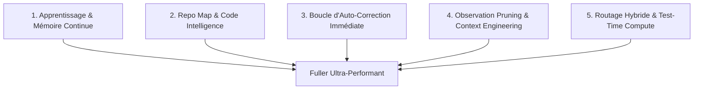

# Rapport d'Analyse et Plan d'Optimisation pour l'Agent Fuller
**Auteur :** Antigravity (Google DeepMind - Advanced Agentic Coding)  
**Date :** 24 Septembre 2026  
**Cible :** Agent CLI/TUI Fuller (`kafuicharbeleklu/fuller`)  
**Version analysée :** Architecture TypeScript / Ink / React + Google Gemini  

---

## 1. Contexte & Diagnostic de l'Existant

Fuller est un assistant terminal pair-programming particulièrement bien conçu, développé en Node.js 20+ avec TypeScript et Ink/React. L'architecture actuelle dispose déjà de fondations solides :
- **TUI & Rendu Réactif :** Un pipeline moderne (`src/ui/`) gérant flexbox, états asynchrones et redimensionnement propre.
- **Boucle Agentique & Outils :** Une boucle interactive (`src/agent/loop.ts`) connectée à un registre d'outils complet (`execute_bash`, `read_file`, `write_file`, `edit_file`, `search_files`, `web_fetch`, `todo_write`, `agent`).
- **Contrôle & Sécurité :** Un système de permissions (`src/permissions/`) et de checkpoints transactionnels (`src/checkpoint/`).
- **Gestion de Session & Contexte :** Chargement hiérarchique de mémoire (`src/agent/contextLoader.ts`) et compaction d'historique.

### La Problématique Clé
> **Le seul fait d'intégrer un modèle LLM de pointe suffit-il à rendre l'agent optimal ?**

**Réponse formelle : Non.**  
Les benchmarks de référence (SWE-bench, GAIA) et les retours d'expérience sur Claude Code, Cursor et Aider démontrent qu'un modèle isolé ne résout que 15 % à 20 % des problèmes réels de développement. **Le code du harnais (scaffolding)** qui encadre le modèle est responsable de **70 % à 80 % de l'efficacité perçue, de la justesse du code produit et de l'économie de tokens**.

Même avec un modèle open-source plus compact (ex. famille Gemma ou Qwen), un harnais haut de gamme permet d'atteindre des résultats comparables aux modèles frontières sur des tâches de développement ciblées.

---

## 2. Synthèse Comparative : État de l'Art des Agents de Codage

| Caractéristique | Claude Code (Anthropic) | Aider (SWE-bench SOTA) | Fuller (Actuel) | Fuller (Cible Optimisée) |
| :--- | :--- | :--- | :--- | :--- |
| **Mémoire & Apprentissage** | Auto-injection `CLAUDE.md`, mémoire dynamique | Mémoire de session via git | Fichiers `FULLER.md` statiques | **Auto-apprentissage via `save_memory` & `/learn`** |
| **Vision du Codebase** | Recherche textuelle + subagents | **Repo Map** (AST Tree-sitter + PageRank) | `search_files`, `glob`, `read_file` | **Outil `outline_file` + Repo Map dynamique** |
| **Auto-Correction** | Boucle terminale itérative | Linter post-edit + git diff | Vérification manuelle par bash | **Validation syntaxique in-memory immédiate** |
| **Gestion du Contexte** | Pruning dynamique du prompt | Compression stricte par budget tokens | Troncature statique + `/compact` | **Observation Masking des anciens tours** |
| **Décomposition Tâches** | Mode plan + sous-agents | Architect / Editor mode | Mode plan + `agent` subagent | **Chaînage multi-agents spécialisés** |

---

## 3. Les 5 Piliers d'Optimisation du Code de Fuller



---

### Pilier 1 : Mémoire Active & Apprentissage Continu (Self-Evolving Memory)
*Transformer Fuller d'un agent amnésique à un collaborateur qui capitalise sur chaque session.*

#### Problème actuel
Le système actuel lit `FULLER.md` (`src/agent/contextLoader.ts`), mais l'agent n'a aucun moyen autonome d'y inscrire ce qu'il apprend (commandes spécifiques au repo, pièges rencontrés, préférences utilisateur).

#### Solutions de code à implémenter :
1. **Outil natif `save_memory` :**
   - **Fichiers cibles :** `src/tools/registry.ts`, `src/agent/contextLoader.ts`.
   - **Déclaration :**
     ```typescript
     {
       name: 'save_memory',
       description: 'Save a project convention, recurring command, or user preference for future sessions.',
       parameters: {
         type: Type.OBJECT,
         properties: {
           fact: { type: Type.STRING, description: 'The concise insight or rule to remember.' },
           scope: { type: Type.STRING, enum: ['project', 'user'], description: 'project (./FULLER.md) or user (~/.fuller/FULLER.md)' }
         },
         required: ['fact', 'scope']
       }
     }
     ```
2. **Commande slash `/learn` :**
   - **Fichier cible :** `src/ui/commands.ts`.
   - Permet à l'utilisateur de taper directement `/learn Toujours lancer les tests avec vitest --run` pour persister la consigne sans ouvrir d'éditeur.
3. **Consigne réflexive dans le System Prompt :**
   - Mettre à jour `src/agent/systemPrompt.ts` pour inciter l'agent à appeler `save_memory` lorsqu'il est corrigé par l'utilisateur ou lorsqu'il découvre une commande de build/test non standard.

---

### Pilier 2 : Repo Map & Sémantique Structurelle (Code Intelligence)
*Résoudre le problème de la cécité architecturale et diviser par 5 la consommation de tokens de lecture.*

#### Problème actuel
Pour explorer un fichier, Fuller utilise `read_file` (qui renvoie jusqu'à 2 000 lignes) ou `search_files` (recherche textuelle ripgrep sans compréhension de la portée des fonctions/classes).

#### Solutions de code à implémenter :
1. **Outil `outline_file` (AST / Symbol Extractor) :**
   - **Fichiers cibles :** `src/tools/search.ts`, `src/tools/registry.ts`.
   - Analyse un fichier source (`.ts`, `.tsx`, `.js`, `.py`, `.go`) et extrait uniquement :
     - Noms de classes, interfaces, fonctions exportées, routes et signatures de méthodes.
     - Leurs numéros de ligne de début et de fin.
   - **Bénéfice :** L'agent repère la méthode cible en 20 tokens, puis utilise `read_file(offset, limit)` pour ne lire que les 25 lignes nécessaires.
2. **Repo Map léger (Inspiré d'Aider) :**
   - Générer au lancement ou sur demande un graphe résumé des modules principaux sous un budget de 500 à 1 000 tokens injecté dans l'environnement.

---

### Pilier 3 : Boucle d'Auto-Correction & Garde-Fous (Test-Time Compute)
*Éliminer les régressions et garantir que le code rendu est syntaxiquement et logiquement valide.*

#### Problème actuel
Si `edit_file` génère une erreur de syntaxe ou un import manquant, l'agent ne s'en rend compte que si l'utilisateur le lui signale ou s'il décide explicitement de lancer un test.

#### Solutions de code à implémenter :
1. **Syntax Check in-memory post-edit :**
   - **Fichier cible :** `src/tools/fileOps.ts`.
   - Immédiatement après l'application du remplacement dans `editFile` :
     - Pour les fichiers TypeScript/JavaScript : exécution ultra-rapide de `ts.createSourceFile` (sans compiler le projet entier).
     - Pour les fichiers JSON : `JSON.parse`.
     - Si une erreur de syntaxe survient, l'outil échoue immédiatement avec un message clair :  
       *`Syntax error introduced at line 42: Unexpected token. File reverted. Please re-apply edit with correct syntax.`*
     - Le modèle s'auto-corrige au tour suivant sans intervention humaine.
2. **Contrat "Verify Before Return" :**
   - Dans `src/agent/systemPrompt.ts`, conditionner la clôture d'une tâche à l'exécution préalable d'une commande de validation (`execute_bash` sur tests, linter ou typecheck).

---

### Pilier 4 : Optimisation du Contexte (Observation Pruning & Caching)
*Maintenir une réactivité maximale et supprimer le phénomène d'oubli sur les sessions longues.*

#### Problème actuel
Sur des sessions de 20 tours, les gros outputs de `execute_bash` (ex: 300 lignes de log) et les contenus de `read_file` restent présents dans l'historique complet envoyé à l'API Gemini, provoquant :
- Une hausse drastique des coûts et des temps de latence (TTFT).
- Le phénomène de *Lost in the Middle* (dégradation de l'attention du modèle).

#### Solutions de code à implémenter :
1. **Observation Pruning (Masquage historique) :**
   - **Fichier cible :** `src/agent/loop.ts`.
   - Pour les tours précédant les 3 derniers échanges, remplacer les corps de résultats volumineux par des résumés compacts :
     - `[Output execute_bash 'npm test': 18 tests passed (exit 0) - full logs pruned]`
     - `[File content 'src/index.tsx' previously read (180 lines) - pruned]`
2. **Dynamic Context Assembly :**
   - Injecter systématiquement au sommet de chaque tour :
     - Le statut git concis (`git status --short`).
     - La liste des 5 derniers fichiers modifiés durant la session.
3. **Prompt Caching Gemini :**
   - Mettre en cache la portion statique (System Prompt + Skills + MCP + Memory globale) via l'API de cache contextuel de Gemini pour réduire le coût des tokens d'entrée de 75 %.

---

### Pilier 5 : Décomposition Multi-Agents & Rôles Spécialisés
*Faire coopérer des modèles ciblés pour surpasser un modèle géant unique.*

#### Architecture suggérée :
- **Architect Subagent :** Se concentre sur l'analyse, la lecture de la documentation et la rédaction d'un plan d'implémentation.
- **Editor Subagent :** Reçoit le plan et effectue les modifications de code chirurgicales (`edit_file`).
- **Verifier Subagent :** Lance les tests, analyse les diffs et valide la conformité avant approbation finale.

Cette séparation permet d'utiliser des modèles très rapides et économiques (comme **Gemma** ou **Gemini Flash**) pour l'édition et la vérification, tout en réservant la réflexion complexe à l'architecture.

---

## 4. Feuille de Route d'Implémentation Recommandée

| Étape | Intitulé | Complexité | Impact Immédiat | Fichiers Cibles |
| :---: | :--- | :---: | :---: | :--- |
| **1** | **Mémoire active (`save_memory` + `/learn`)** | Faible | ⭐⭐⭐⭐⭐ | `src/tools/registry.ts`, `src/agent/contextLoader.ts`, `src/ui/commands.ts` |
| **2** | **Validation syntaxique in-memory post-edit** | Faible | ⭐⭐⭐⭐ | `src/tools/fileOps.ts` |
| **3** | **Outil `outline_file` (Symbol Extractor)** | Moyenne | ⭐⭐⭐⭐⭐ | `src/tools/search.ts`, `src/tools/registry.ts` |
| **4** | **Observation Pruning (Masquage des vieux logs)** | Moyenne | ⭐⭐⭐⭐ | `src/agent/loop.ts` |
| **5** | **Dynamic Context (`git status` & recent files)** | Faible | ⭐⭐⭐⭐ | `src/agent/systemPrompt.ts`, `src/agent/loop.ts` |

---

## 5. Conclusion & Recommandation

Le passage à **React / Ink** a apporté à Fuller l'armature idéale. L'étape suivante pour hisser Fuller au niveau des standards mondiaux (Claude Code, Cursor) ne nécessite pas d'attendre un modèle IA magique : elle réside dans **l'intelligence de son harnais logiciel**.

L'implémentation de la **Phase 1 (Mémoire Active)** et de la **Phase 2 (Code Intelligence / Outline)** constitue le levier au ratio effort/gain le plus élevé.
